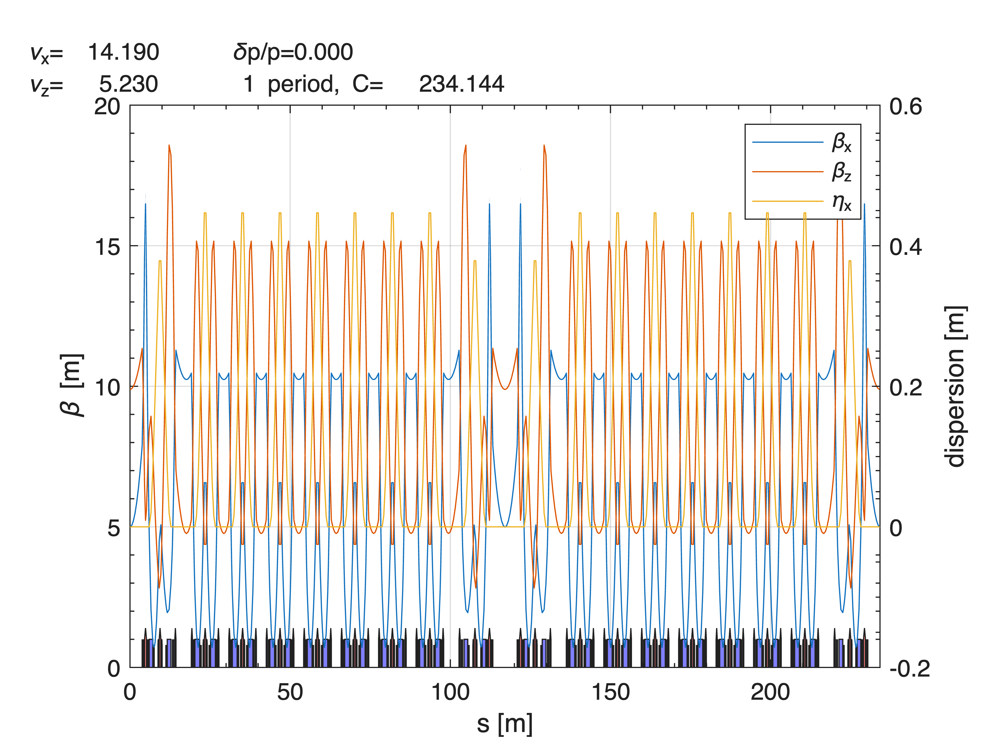

<a id="T_703E94F3"></a>

# Installing the Accelerator Toolbox
<!-- Begin Toc -->

## Table of Contents
&emsp;[System Requirements](#H_C146C4C3)
 
&emsp;[Getting the Accelerator Tooolbox](#H_0C7B2124)
 
&emsp;&emsp;[From Matlab Central](#H_B24C3917)
 
&emsp;&emsp;[From GitHub](#H_CE6C6A56)
 
&emsp;&emsp;&emsp;[1. Install git on your computer](#H_70FE27F2)
 
&emsp;&emsp;&emsp;[2. Download the latest version of AT:](#H_7E2A9510)
 
&emsp;&emsp;&emsp;[3. Set the Matlab path](#H_9409CB24)
 
&emsp;[Compiling the C/C++ integrators](#H_58A2F6F7)
 
&emsp;[Checking the installation](#H_3A90030F)
 
<!-- End Toc -->
<a id="H_C146C4C3"></a>

# System Requirements

AT is compatible with Matlab release 2016b (Matlab 9.1) or newer.


AT runs on Linux, Windows or MacOS versions compatible with the Matlab version used.


AT needs a C/C++ compiler compatible with the Matlab version used. For more information, visit [Mathworks](https://www.mathworks.com) support and look for supported and compatible C:C++ compilers.

<a id="H_0C7B2124"></a>

# Getting the Accelerator Tooolbox
<a id="H_B24C3917"></a>

## From Matlab Central

This is the recommended method which lets you install the last stable version.


From the "Environment" tab of the Matlab command window, in the "Add\-Ons" menu, select "Manage Add\-Ons". The in the Add\-On Manager window, click in "Get Add\-Ons". Search for "particle accelerators" and look for:


Click on "Add". You can also download the toolbox from the [Matlab](https://www.mathworks.com) Web site.

<a id="H_CE6C6A56"></a>

## From GitHub

This lets you install the last updated version.

<a id="H_70FE27F2"></a>

### 1. Install git on your computer
<a id="H_7E2A9510"></a>

### 2. Download the latest version of AT:
```
$ git clone https://github.com/atcollab/
```
<a id="H_9409CB24"></a>

### 3. Set the Matlab path

Insert recursively the directories *<**`at_installation>`*`/atmat` and *<**`at_installation>`*`/atintegrators` in the Matlab path. This can be done by:

-  Using the GUI: Open the "Set Path" window, press "Add with subfolders", select *<**`at_installation>`*`/atmat`; repeat the operation for *<**`at_installation>`*`/atintegrators`. 
-  Using the `startup.m` file: Insert a line `addpath(genpath(`*<**`at_installation>`*`/atmat))` and a similar one for atintegrators. 
-  Temporarily modifying the path by running: 
```
>> cd  <at_installation>/atmat
>> atpath
```
<a id="H_58A2F6F7"></a>

# Compiling the C/C++ integrators 

The compilation of all the components if performed by running:

```
>> atmexall
```
<a id="H_3A90030F"></a>

# Checking the installation

AT installation may be checked by looking at the ouput of the command:

```matlab
atdiag
```

```matlabTextOutput
>> ring=atradoff(spear3);
>> atplot(ring);
```



```matlabTextOutput
If you see beta-function plots, AT is installed correctly
```

