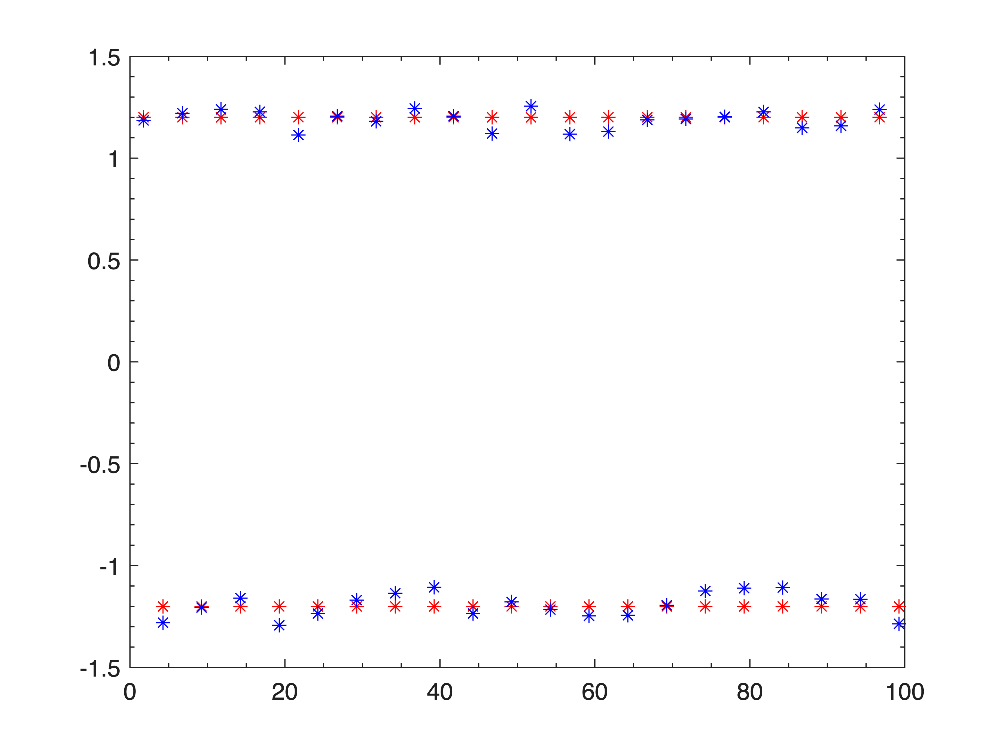

<a id="T_50C14515"></a>

# AT Primer
<!-- Begin Toc -->

## Table of Contents
&emsp;[Introduction](#H_5D99BC29)
 
&emsp;[Coordinate system](#H_D29EAD66)
 
&emsp;[Creation of Elements and Lattices](#H_38D68B5B)
 
&emsp;[Lattice Querying and Manipulation](#H_4A4E836B)
 
&emsp;[Tracking](#H_73F74A5D)
 
&emsp;[Computation of beam parameters](#H_BB263AF4)
 
&emsp;[Beam sizes](#H_50F80EE5)
 
&emsp;[Bibliography](#H_46E010AF)
 
<!-- End Toc -->
<a id="H_5D99BC29"></a>

# Introduction

The Accelerator Toolbox (AT) is a toolbox of functions in Matlab for charged particle beam simulation. It was created by Andrei Terebilo in the late 1990's. The original papers ([\[1\]](https://www.slac.stanford.edu/pubs/slacpubs/8500/slac-pub-8732.pdf), [\[2\]](https://inspirehep.net/files/298dd81ab9ce89bfb2a42442b46b0379)) still serve as a good introduction to AT. The version described in those papers is AT1.3, the latest version produced by Terebilo. The next version of AT is considered AT2.0. Here we provide examples showing some of the changes from AT1.3, but also serving as an introduction for someone just starting AT.

<a id="H_D29EAD66"></a>

# Coordinate system

The 6\-d phase space coordinates used in AT are as follows:

 $$ \vec{Z} =\left(\begin{array}{c} x\newline \frac{p_x }{p_0 }=x^{\prime } (1+\delta )\newline y\newline \frac{p_y }{p_0 }=y^{\prime } (1+\delta )\newline \delta =\frac{\left(p_z -p_0 \right)}{p_0 }\newline c\tau  \end{array}\right)\, $$ 

 $p_0$ is the reference momentum, $\tau$ is the time lag relative to the ideal particle.

<a id="H_38D68B5B"></a>

# Creation of Elements and Lattices

A lattice in AT is a Matlab column cell array containing the lattice elements. These elements may be created using element creation functions. These functions output element structures. For example, a quadrupole may be created with the function **atquadrupole**:

```matlab
QF=atquadrupole('QF',0.5,1.2,'StrMPoleSymplectic4Pass')
```

```matlabTextOutput
QF = struct with fields:
        FamName: 'QF'
     PassMethod: 'StrMPoleSymplectic4Pass'
         Length: 0.500000000000000
          Class: 'Quadrupole'
              K: 1.200000000000000
       PolynomB: [0 1.200000000000000]
       PolynomA: [0 0]
       MaxOrder: 1
    NumIntSteps: 10
```


We note that the family name of this quadrupole is 'QF' and the pass method is StrMPoleSymplectic4Pass. The fields following are parameters necessary to be able to pass an electron through this quadrupole (i.e., the set of arguments required by the pass method). We now create some other elements needed in a FODO lattice:

```matlab
Dr=atdrift('Dr',0.5);
HalfDr=atdrift('Dr2',0.25);
QD = atquadrupole('QD',0.5,-1.2);
Bend=atsbend('Bend',1,2*pi/40);
```

In addition to **atquadrupole** that we already saw, we have created a drift (region with no magnetic field), using **atdrift**. Besides the family name, the only other needed field is the length. Since we split the cell in the center of the drift, we have also created a half drift element. The drifts are 0.5 meters long and the half drift is 0.25 meters long. We have defined a sector dipole, or bend magnet using **atsbend**. The family name is 'Bend'. The second field is the length of the magnet and we have given it a length of 1 meter. Next is the bending angle. We have defined just an arc of a FODO lattice here, so we don't have to bend by all of $2\pi$ here. We choose to have 20 total such arcs, for a realistic field strength, and thus we define the bending angle to be $2\pi /40$ since there are two bends per cell. The default pass method for the bend is 'BndMPoleSymplectic4Pass'. This is a 4th order symplectic integrator. We outline the integrators in a later section.


A cell of a FODO lattice may now be constructed as follow:

```matlab
FODOcell={HalfDr;Bend;Dr;QF;Dr;Bend;Dr;QD;HalfDr};
```

As mentioned, this cell is only 1/20 of a FODO lattice. The entire lattice may be created by repeating this cell 20 times as follows

```matlab
FODO=repmat(FODOcell,20,1);
```

Finally, we create a RingParam element and add it to our lattice. This allows us to give a name to the lattice and set the ring energy. This is done as follows:

```matlab
RP=atringparam('Simple FODO lattice',1e9);
FODO=[{RP};FODO];
```

The energy of a lattice may be retrieved with the function **atenergy**. Thus

```matlab
atenergy(FODO)
```

```matlabTextOutput
ans =      1.000000000000000e+09
```


Another way to set the energy of a lattice uses the function **atsetenergy**. This puts an energy field in all elements and set it to the requested value. The energy element is required in the RF cavities and also in other magnets such as dipoles and quadrupoles in the case that classical radiation effects are included.


We have now created a valid AT lattice, using drifts, dipoles, and quadrupoles. We will later add some sextupoles to this lattice, and also an RF cavity, but one could track particles through this lattice, as is.


For completeness, we list all of the AT element creation functions: **ataperture**, **atbaseelem**, **atcorrector**, **atdampMatElem**, **atdrift**, **atidtable**, **atM66**, **atM66Tijk**, **atmarker**, **atmonitor**, **atmultipole**, **atquadrupole**, **atQuantDiff**, **atrbend**, **atrfcavity**, **atringparam**, **atsbend**, **atsextupole, atskewquad**, **atsolenoid**, **atthinmultipole**, **atwiggler**.

<a id="H_4A4E836B"></a>

# Lattice Querying and Manipulation

There are many parameters in a storage ring lattice. We need tools to view these parameters and to change them.


We have seen how to concatenate elements to form a lattice. To extract elements, there are two approaches, one may use either indices giving the explicit element numbers, or one can use a logical mask. Thus, to extract the 4th element of our FODOCell lattice, (a focusing quadrupole, 'QF'), one may either write 'FODOcell{4}'. Likewise, we may also construct a logical mask with:

```matlab
mask=false(1,length(FODOcell));
mask(4)=true;
```

The command 'FODOCell(mask)' will also give the same 'QF' element.


Next, we describe three important functions for working with AT lattices: **atgetcells**, **atgetfieldvalues**, and **atsetfieldvalues.** **atgetcells** allows one to find the indices of elements in the lattice searching for various criteria. The second to allow extraction and setting of element parameters.


As a first example of **atgetcells** let us extract the indices of all of the QF's as follows

```matlab
QFIndices = atgetcells(FODOcell,'FamName','QF')
```

```matlabTextOutput
QFIndices = 9x1 logical array
   0
   0
   0
   1
   0
   0
   0
   0
   0

```


where we see the 'QF' at element 4. To convert this logical mask to an index, use the **find** command.

```matlab
find(QFIndices)
```

```matlabTextOutput
ans =      4
```


A new feature added to AT 2.0 is element classes. These are *Drift*, *Bend*, *Quadrupole*, *Sextupole*, *Octupole*, *Multipole*, *ThinMultipole*, *Wiggler*, *KickMap*, *RFCavity*, *QuantDiff*, *Monitor*, *Corrector*, *Solenoid*, *Matrix66*, *RingParam*. This allows us to get the indices for all of the quadrupoles with the command.

```matlab
QuadIndices = atgetcells(FODO,'Class','Quadrupole')
```

```matlabTextOutput
QuadIndices = 181x1 logical array
   0
   0
   0
   0
   1
   0
   0
   0
   1
   0
   0
   0
   0
   1
   0

```


with the result

```matlab
find(QuadIndices)
```

```matlabTextOutput
ans = 40x1
     5
     9
    14
    18
    23
    27
    32
    36
    41
    45
    50
    54
    59
    63
    68

```


showing the indices of both 'QF' and 'QD' in the FODO cell.


The reader can look further into the help for **atgetcells** by typing

```matlab
help atgetcells
```

```matlabTextOutput
 atgetcells performs a search on MATLAB cell arrays of structures
 
  OK = atgetcells(RING, 'field')
    returns indexes of elements that have a field named 'field'
 
  OK = atgetcells(RING, 'field', VALUE1...)
    returns indexes of elements whose field 'field'
    is equal to VALUE1, VALUE2, ... or VALUEN. Where VALUE can either be
    character strings or a number. If its a character string REGULAR
    expressions can be used.
 
  OK = atgetcells(RING, 'field', @TESTFUNCTION, ARGS...)
    Uses the user-defined TESTFUNCTION to select array elements
    TESTFUNCTION must be of the form:
        OK=TESTFUNTION(ATELEM,FIELDVALUE,ARGS...)
 
  OK is a logical array with the same size as RING, refering to matching
  elements in RING
 
  See also atgetfieldvalues, atsetfieldvalues, findcells, regexpi
```


to see other ways this function can be used, including the use of matching regular expressions.


The **atgetfieldvalues** command may be used to extract the fields with the elements. For example the quadrupole strengths may be retrieved using the command.

```matlab
Kvals=atgetfieldvalues(FODO,QuadIndices,'PolynomB',{1,2})
```

```matlabTextOutput
Kvals = 40x1
1.200000000000000
  -1.200000000000000
1.200000000000000
  -1.200000000000000
1.200000000000000
  -1.200000000000000
1.200000000000000
  -1.200000000000000
1.200000000000000
  -1.200000000000000
1.200000000000000
  -1.200000000000000
1.200000000000000
  -1.200000000000000
1.200000000000000

```


The **atsetfieldvalues** command may be used to set the values of parameters. As a simple example, we may add some random errors to all the quadrupoles strengths:

```matlab
Kvalserr=Kvals+0.2*(rand(length(Kvals),1)-0.5);
FODOerr=atsetfieldvalues(FODO,QuadIndices,'PolynomB',{1,2},Kvalserr);
```

Note that the output of **atsetfieldvalues** is another lattice structure, which here we call 'FODOerr' which has the quadrupole strengths 'Kvalserr'. Now we have both 'FODO' and 'FODOerr' in the Matlab workspace and we can examine them or do calculations for comparison.


Suppose we would like to plot the quadrupole strengths along the lattice. We first need to find the longitudinal position $s$ of each quadrupole. This may be done with the function **findspos**:

```matlab
quadspos = findspos(FODO,QuadIndices);
```

The quadrupole strengths of 'FODO' and 'FODOerr' may now be plotted with:

```matlab
plot(quadspos,Kvals,'*r',quadspos,Kvalserr,'*b');
```


<a id="H_73F74A5D"></a>

# Tracking

Once a lattice is defined, electrons may be tracked through it. **ringpass** is the function that does the tracking. An example of its use is as follows:

```matlab
nturns=200;
Z01=[.001;0;0;0;0;0];
Z02=[.002;0;0;0;0;0];
Z03=[.003;0;0;0;0;0];
Z1=ringpass(FODO,Z01,nturns);
Z2=ringpass(FODO,Z02,nturns);
Z3=ringpass(FODO,Z03,nturns);
plot([Z1(1,:); Z2(1,:); Z3(1,:)]',[Z1(2,:); Z2(2,:); Z3(2,:)]','.')
```


In this example, we started with one initial condition, and all subsequent turns are returned by ringpass. We may also start with multiple initial conditions:

```matlab
Z0=[.001;0;0;0;0;0]*(1:3);
Z200=ringpass(FODO,Z0,nturns);
```

Examining the variable Z200, we find

```matlab
whos Z200
```

```matlabTextOutput
  Name      Size             Bytes  Class     Attributes

  Z200      6x600            28800  double              
```


The structure of this matrix is that the first three columns are the results of tracking for one turn the three initial conditions. The following columns are likewise grouped in threes with the subsequent results of tracking further turns. We may retrieve the same results as we had previously by extracting every third column vector as follows:

```matlab
ZZ1=Z200(:,1:3:end);
ZZ2=Z200(:,2:3:end);
ZZ3=Z200(:,3:3:end);
```


Now the same plot as in Figure \[2\](*\#trackPlot*){reference\-type="ref"


reference="trackPlot"} results from the plot command

```matlab
plot(ZZ1(1,:),ZZ1(2,:),'.r',ZZ2(1,:),ZZ2(2,:),'.b',ZZ3(1,:),ZZ3(2,:),'.k')
```


Another way to process the output of ringpass with multiple initial particles uses the **reshape** command

```matlab
ZZ200=reshape(Z200,6,3,nturns);
ZZZ1=ZZ200(:,1,:);
ZZZ2=ZZ200(:,2,:);
ZZZ3=ZZ200(:,3,:);
```

This can be a convenient approach to process the results when many initial conditions are tracked.

<a id="H_BB263AF4"></a>

# Computation of beam parameters

Now that particles can be tracked through the lattice, we can use the tracking to understand different properties of the lattice. First, we would like to understand the linear properties such as Twiss parameters, tunes, chromaticities, etc. These can all be calculated with the function **atlinopt6**.

```matlab
ringdata=atlinopt6(FODO,'get_chrom');
```

Note first the input. The first is the FODO lattice we have created. The second argument asks for optional chromaticity computation. The default values for other optional arguments ask for the computation of on\-momentum linear optics ( $\delta =0$ ). 


The output is a structure with a 'tune' field:

```matlab
ringdata.tune
```

```matlabTextOutput
ans = 1x2
   0.219935676852768   0.917778061267378

```

```matlab
ringdata.chromaticity
```

```matlabTextOutput
ans = 1x2
  -6.340415593405109  -6.198569683757427

```


which tells us the tunes are $\nu_x =0.2199\;$ and $\nu_y =0.9178$.


How did AT calculate these quantities? Without digging into the details of **atlinopt6**, you could still figure it out, just based on the ability to track with the **ringpass** function. In fact, AT computes the one\-turn transfer matrix by tracking several initial conditions and differentiating. The one\-turn transfer matrix (here we focus on 4x4) is computed with the function **findm44** called by **atlinopt6**. Calling this on the FODO lattice, we find

```matlab
findm44(FODO,0)
```

```matlabTextOutput
ans = 4x4
  -0.651856195463927   1.909777971180772                   0                   0
  -0.874303408298951   1.027412785148052                   0                   0
                   0                   0  -0.180734195772826  -3.248298208126986
                   0                   0   0.414666392944749   1.919725814416499

```


The 0 as the second argument tells us to compute with $\delta =0$. We note that the ring is uncoupled, and computing the eigenvalues of submatrices, we derive the tunes reported by **atlinopt6** above.


Computing the tunes with varying initial $\delta$ allows the computation of the chromaticity.


Now, suppose we would like to change the tunes in our FODO lattice. We know that we should change the quadrupole strengths, but we may not know exactly what values to use.


Here we reach the question of tuning. How do we set the parameters for these quadrupoles in order to correct the tunes? In principle we have the tools that we need. We can set the values of the quadrupoles using the function **atsetfieldvalues** and then recompute the chromaticity with **atlinopt6**. But we still don't know what values to actually give the quadrupoles. One could compute the value, or instead use an optimization routine to vary the values until the correct output tunes are achieved. This is the approach followed with the function **atfittune**.


This allows you to vary quadrupole strengths until the desired tune values are reached. It is used as follows

```matlab
FODO2=atfittune(FODO,[0.15,0.75],'QF','QD');
```

which would set the tunes to $\nu_x =0.15$ and $\nu_y =0.75$ using the quadrupoles QF and QD. When we actually try this, and compute the linear optics, we find the result

```matlab
ringdata2=atlinopt6(FODO2);
ringdata2.tune
```

```matlabTextOutput
ans = 1x2
   0.151113806298435   0.750784159268849

```


We see that the requested values have almost been reached, but not exactly. A second call to **atfittune** gives:

```matlab
FODO2=atfittune(FODO2,[0.15,0.75],'QF','QD');
ringdata2=atlinopt6(FODO2);
ringdata2.tune
```

```matlabTextOutput
ans = 1x2
   0.150000081733871   0.750000070691616

```


Giving satisfactory results for the tunes.


Now, in case you have some experience with storage ring dynamics, you will know that these negative chromaticity values will lead to instability and thus our FODO lattice, as is, is not acceptable. To fix this problem, we add sextupoles to our lattice. We define a focusing and defocussing sextupoles (0.1 meter long) as follows:

```matlab
SF=atsextupole('SF',0.1,1);
SD=atsextupole('SD',0.1,-1);
```

Now we want to add these to the lattice at locations where they will be effective. We will put them in the middle of the 0.5 meter drift sections: SF before the QF and SD before the QD. Let's locate the drifts:

```matlab
find(atgetcells(FODOcell,'FamName','DR'))
```

```matlabTextOutput
ans = 3x1
     3
     5
     7

```


We will insert SF in the middle of element 3 and SD in the middle of element 7. 

```matlab
FODOcellSext=atinsertelems(FODOcell,[3 7], 0.5, {SF,SD});
```

And now we can define our lattice cell with sextupoles as follows:

```matlab
FODOSext=[{RP};repmat(FODOcellSext,20,1)];
ringdataS=atlinopt6(FODOSext,'get_chrom');
ringdataS.tune
```

```matlabTextOutput
ans = 1x2
   0.219935676852768   0.917778061267380

```

```matlab
ringdataS.chromaticity
```

```matlabTextOutput
ans = 1x2
  -4.936669724268465  -5.650387500851413

```


The tunes of FODOSext are identical to the ones of FODO. Now we need to tune the sextupoles. For this, we will use the function **atfitchrom**. This function works analogously to **atfittune** except the sextupoles are varied instead of the quadrupoles to fit the chromaticity. Applying this function (twice to get a more precise result):

```matlab
FODOSext=atfitchrom(FODOSext,[0.5 0.5],'SF','SD');
FODOSext=atfitchrom(FODOSext,[0.5 0.5],'SF','SD');
```

After changing the tunes and fixing the chromaticities, we find

```matlab
ringdataS=atlinopt6(FODOSext,'get_chrom');
ringdataS.tune
```

```matlabTextOutput
ans = 1x2
   0.219935676852775   0.917778061267372

```

```matlab
ringdataS.chromaticity
```

```matlabTextOutput
ans = 1x2
   0.499999929228408   0.499999969464741

```


**atlinopt6** has a second output argument to give the linear optics parameters that vary around the ring. These are the Twiss parameters, dispersions, phase advance, and coupling parameters. To compute these around the ring, we need to give the indices for the reference points. To compute them at all lattice elements, we call

```matlab
[ringdata,elemdata]=atlinopt6(FODOcellSext,1:length(FODOcellSext)+1);
```

Examining 'elemdata', we find:

```matlab
elemdata
```


|Fields|R|M|A|mu|SPos|ClosedOrbit|alpha|beta|Dispersion|
|:--:|:--:|:--:|:--:|:--:|:--:|:--:|:--:|:--:|:--:|
|1|4x4x2 double|4x4 double|4x4 double|[0,0]|0|[0;0;0;0;0;0]|[-0.854840878954965,2.126228548667526]|[1.944365433223266,6.576296955144217]|[0.534486407273767;0.145785345922460;0;0]|
|2|4x4x2 double|4x4 double|4x4 double|[0.115329877564583,0.041334716035392]|0.250000000000000|[0;0;0;0;0;0]|[-1.077375297994619,1.916351779156296]|[2.427419477460662,5.565651873188261]|[0.570932743754362;0.145785345922460;0;0]|
|3|4x4x2 double|4x4 double|4x4 double|[0.394781548274693,0.308794389520865]|1.250000000000000|[0;0;0;0;0;0]|[-1.841298576366239,1.076844701111378]|[5.370337788212359,2.572455392920587]|[0.787468638440279;0.286395609615487;0;0]|
|4|4x4x2 double|4x4 double|4x4 double|[0.429619168908861,0.393442149702893]|1.450000000000000|[0;0;0;0;0;0]|[-2.004803391909315,0.908943285502394]|[6.139558181867470,2.175297795597832]|[0.844747760363431;0.286395609615487;0;0]|
|5|4x4x2 double|4x4 double|4x4 double|[0.445390635947213,0.441380749975991]|1.550000000000000|[0;0;0;0;0;0]|[-2.086555799680852,0.824992577697904]|[6.548694101026488,2.001904209277805]|[0.873387321325005;0.286395609615299;0;0]|
|6|4x4x2 double|4x4 double|4x4 double|[0.474093610671201,0.549832299365535]|1.750000000000000|[0;0;0;0;0;0]|[-2.250060615223928,0.657091162088920]|[7.416017384007444,1.705487461320440]|[0.930666443248152;0.286395609615299;0;0]|
|7|4x4x2 double|4x4 double|4x4 double|[0.538238334648472,0.862976276973252]|2.250000000000000|[0;0;0;0;0;0]|[2.250060615223929,-0.657091162088924]|[7.416017384007445,1.705487461320440]|[0.930666443248145;-0.286395609615475;0;0]|
|8|4x4x2 double|4x4 double|4x4 double|[0.617550397044980,1.104014186817922]|2.750000000000000|[0;0;0;0;0;0]|[1.841298576366241,-1.076844701111385]|[5.370337788212360,2.572455392920596]|[0.787468638440262;-0.286395609615475;0;0]|
|9|4x4x2 double|4x4 double|4x4 double|[0.897002067755090,1.371473860303390]|3.750000000000000|[0;0;0;0;0;0]|[1.077375297994620,-1.916351779156287]|[2.427419477460663,5.565651873188239]|[0.570932743754337;-0.145785345922447;0;0]|
|10|4x4x2 double|4x4 double|4x4 double|[0.987175051539387,1.405080737619973]|3.950000000000000|[0;0;0;0;0;0]|[0.899347762762896,-2.084253194765271]|[2.032074865309159,6.365772867972551]|[0.541775674569859;-0.145785345922447;0;0]|
|11|4x4x2 double|4x4 double|4x4 double|[1.038619212685138,1.420290545075613]|4.050000000000000|[0;0;0;0;0;0]|[0.810333995147035,-2.168203902569774]|[1.861106689518167,6.791018577706089]|[0.527197139977623;-0.145785345922319;0;0]|
|12|4x4x2 double|4x4 double|4x4 double|[1.155793530265428,1.447966442829471]|4.250000000000000|[0;0;0;0;0;0]|[0.632306459915312,-2.336105318178761]|[1.572578598505697,7.691880421855806]|[0.498040070793158;-0.145785345922319;0;0]|
|13|4x4x2 double|4x4 double|4x4 double|[1.496429572515437,1.509807676435579]|4.750000000000000|[0;0;0;0;0;0]|[-0.632306459915311,2.336105318178752]|[1.572578598505697,7.691880421855779]|[0.498040070793172;0.145785345922460;0;0]|
|14|4x4x2 double|4x4 double|4x4 double|[1.639891157461193,1.544965542926265]|5|[0;0;0;0;0;0]|[-0.854840878954965,2.126228548667525]|[1.944365433223265,6.576296955144216]|[0.534486407273767;0.145785345922460;0;0]|


-  'SPos' is the  $s$ position, 
-  'ClosedOrbit' is the $x,x^{\prime } ,y,y^{\prime }$ coordinate vector of the closed orbit, 
-  'Dispersion' is the $\eta_x ,\eta_x^{\prime } ,\eta_y ,\eta_x^{\prime }$ coordinate vector of the dispersion, 
-  'M' is the local $4\times 4$ transfer matrix, 
-   'beta' gives the horizontal and vertical $\beta$ functions, 
-  'alpha' gives the $\alpha_{x,y}$ Twiss parameters, 
-  'mu' gives the phase advances. 

Let us use these results to plot the beta functions around the ring.

```matlab
beta=cat(1,elemdata.beta);
spos=cat(1,elemdata.SPos);
figure
plot(spos,beta);
xlabel('s [m]');
ylabel('\beta [m]');
legend('\beta_x','\beta_y');
```


We may also plot the lattice parameters using a dedicated function called **atplot** with the command

```matlab
 atplot(FODOcellSext);
```


Note that the magnets are displayed below the function, giving a convenient visualization. Also note that the lattice functions are smoother than those we saw before. They have been computed at more positions, by slicing the magnets in the **atplot** function.

<a id="H_50F80EE5"></a>

# Beam sizes

The parameters computed thus far use only the tracking through the lattice, with no radiation effects. In reality, for electrons, we know that there are radiation effects which cause a damping and diffusion and determine equilibrium emittances and beam sizes. This is computed in AT using the Ohmi envelope formalism. A simple interface to this code is provided via the function **atx** which gives the linear optics parameters we have just computed, and also the beam sizes.


In order to use **atx**, we first need to make sure the beam is stable longitudinally as well, requiring us to add an RF cavity to our FODO lattice. This is done with the command

```matlab
RFC=atrfcavity('RFCav');
```

and the cavity is added to the lattice

```matlab
FODOSextRF=[{RP;RFC};FODOSext(2:end)];
```

Now, we need to set the values of the RF cavity. This can be done with the function **atsetcavity** as follows

```matlab
FODOSextRF=atsetcavity(FODOSextRF,'Frequency','nominal',...
    'Voltage',0.5e6,'HarmNumber',100);
```

which says that the RF cavity has a voltage of 0.5 MV and harmonic number of 100.


We may now call the function **atx** as follows

```matlab
[elemdata,ringdata]=atx(FODOSextRF);
ringdata
```

```matlabTextOutput
ringdata = struct with fields:
              ll: 1.000000000000001e+02
           alpha: 0.041938903740831
       fractunes: [0.219935676852775 0.917778061267372]
       fulltunes: [5.219935676852774 4.917778061267372]
             nuh: 5.219935676852774
             nuv: 4.917778061267372
    chromaticity: [0.499999929228408 0.499999969464741]
     dampingtime: [3.576759844853735e+07 8.159908391299666e+05 7.187747056643736e+06]
        dampingJ: [0.080305927342242 3.520076481835642 0.399617590822116]
         espread: 0
         blength: 0
    modemittance: [NaN NaN NaN]
          energy: 1.000000000000000e+09
              fs: 5.480631886907823e+04
           eloss: 0
    synchrophase: 0
      momcompact: 0.041938903740831
```


We see that our FODO lattice has an emittance of 33.65 nm, an energy spread of $3.3\times 10^{-4}$ and a bunch length of 12.1 mm.

<a id="H_46E010AF"></a>

# Bibliography

[\[1\]](https://www.slac.stanford.edu/pubs/slacpubs/8500/slac-pub-8732.pdf) A. Terebilo *Accelerator Toolbox for Matlab*, SLAC\-PUB 8732 (May 2001)


[\[2\]](https://inspirehep.net/files/298dd81ab9ce89bfb2a42442b46b0379) A. Terebilo, *Accelerator Modelling with Matlab Accelerator Toolbox*, PAC 2001 Proceedings


[\[3\]](https://inspirehep.net/files/8507fec63dc914e41a782b13b831c64e) B. Nash *et al.*, *New Functionality for Beam Dynamics in Accelerator Toolbox*, IPAC 2015


[\[4\]](https://journals.aps.org/prab/pdf/10.1103/PhysRevSTAB.2.074001) D. Sagan, D. Rubin, *Linear Analysis of Coupled Lattices*, Phys. Rev. Special Topics \- Accelerators and Beams, Vol 2,(1999) 

