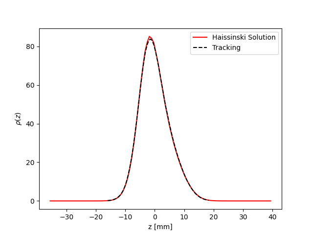

Collective
==========

Overview
--------

A collective effects element can be added to any lattice to model
impedance driven collective effects and perform multi-particle tracking.
This element can be constructed with either a user defined table, or by
using the built in functions to construct specific elements (for example
a longitudinal resonator or a transverse resistive wall). The element will
then call the **WakeFieldPass** PassMethod. 

The wake field is applied by first uniformly slicing the full region occupied by the 
particles in the ct co-ordinate. Each particle is attributed to a
given slice, which is represented by a weight. The mean position in x,y,ct 
is computed for each slice. The kick from one slice to the next (and the self kick for some cases)
can then be computed by taking into account the differences in offsets of each slice.
This total kick is computed and the appropriate modification to x', y' or dp is applied
to each particle. 

To take into account multi-turn wakes, the wake element has a **TurnHistory** buffer.
Each turn, the mean x,y,ct and weight of each slice is recorded. At each turn, the 
array of ct values is increased by one circumference (to take into account the decay 
between turns). When the kick is computed, the full history of turns to ensure the
total kick from all previous turns is considered.

The package is organised as follows:

**at.collective.wake_functions** contains the analytic wake functions that can be called
by the other classes

The longitudinal resonator wake function is given by :ref:`Bibliography`

.. math:: W_{z}(\tau) = \left\{ \begin{array}{lr} \alpha R_{s} \;\;\;\;\;\;\;\;\;\;\;\;\;\;\;\;\;\;\;\;\;\;\;\;\;\;\;\;\;\;\;\;\;\;\;\;\;\;\;\;\;\;\;\;\;   \text{for } \tau=0 \\ 2\alpha R_{s}e^{-\alpha \tau} [\text{cos}(\bar{\omega}\tau) - \frac{\alpha}{\bar{\omega}}\text{sin}(\bar{\omega}\tau)]\;\;\;\; \text{for}\ \tau > 0 \\ \end{array} \right. 

where :math:`R_{s}` is the resonator shunt impedance in Ohms, :math:`\alpha=\omega_{R}/2Q`, :math:`\omega_{R}` is the resonator angular frequency in Hz.rad, :math:`Q` is the resonator quality factor and :math:`\bar{\omega}=\sqrt{\omega_{R}^{2} - \alpha^{2}}`  . The units of the longitudinal wake function are V/C.

The transverse resonator wake function is given by [2]

.. math:: W_{x,y}(z) = -\frac{c R_{s}\omega_{R}}{Q\bar{\omega}}e^{-\alpha z / c} \text{sin}(\bar{\omega} z / c).

but here we use the slightly modified transverse resonator function that is given by

.. math:: W_{x,y}(\tau) = -\frac{ R_{s} \omega_{R}^{2}}{Q\bar{\omega}}e^{-\alpha \tau} \text{sin}(\bar{\omega}\tau).

The definitions are the same as for the longitudinal resonator.

The units of the transverse resonator wake function are V/C/m (but not really)

The transverse resistive wall wake function is defined as [3]

.. math:: W_{x,y}(z) = -\frac{2}{\pi b^{3}}\sqrt{\frac{c}{\sigma_{c}}}\frac{1}{|z|^{1/2}}L.

but we use the modified version given by

.. math:: W_{x,y}(\tau) = -\frac{\beta_{x,y}L}{\pi b^{3}}\sqrt{\frac{Z_{0} c}{\pi \sigma_{c} \tau}}.

where :math:`b` is the vacuum chamber half gap in m, :math:`Z_{0}=\pi * 119.9169832` is the impedance of free space in Ohms, c is the velocity of light in m/s, :math:`L` is the length of resistive wall component and :math:`\sigma_{c}` is the conductivity in Siemens. 

The transverse resistive wall function is an approximation, as it clearly diverges for :math:`\tau` close to 0, but when considering multi bunch models the approximation works well. 

Also included is a function to convolve a wake field with a gaussian bunch to compute the wake potential (convolve_wake_fun)
This function can be useful to combine multiple wake potentials (for example to include an analytical
wake function with the wake potential output from GDfidL). 

These above functions can be directly called 

.. code:: python

    from at.collective.wake_functions import long_resonator_wf
    from at.collective.wake_functions import transverse_resonator_wf
    from at.collective.wake_functions import transverse_reswall_wf
 
**at.collective.wake_objects** is used to construct a python object which represents a wake field or wake potential. The functions in wake_objects can be called directly to construct and test (and use for purposes outside of tracking in PyAT). The wake object can contain wake fields in multiple planes simultaneously, and may combine wake fields from a table of data with analytical wake functions. All of this is handled by the functions found in this module. 

**at.collective.wake_elements** uses the functions found in **at.collective.wake_objects** to generate a wake field element that can be appended to the AT lattice to be used for tracking. 

**at.collective.haissinski** contains functions and methods to solve the Haissinski equation in the presence of a longitudinal wake potential in order to obtain the analytical bunch distribution. 

Generating a Wake Element
-------------------------

We can start with a simple ring. 

.. code:: python

    import at
    ring = at.load_m('at/machine_data/esrf.m')

First we can call the fast_ring function to reduce significantly the number of elements we will need to track

.. code:: python

    fring, _ = at.fast_ring(ring)

First we must define an srange for the wake function. The wake_function will be computed at the values of the srange array, and an interpolation will be made during the tracking if the required dz of the 2 slices falls in between 2 data points. As a way of saving memory, the wake_object contains a useful function for computing the srange such that is is finely sampled only around where the bunches are expected to be. In this example, we will specify how many turns we would like the wake memory to be

.. code:: python

    from at.constants import clight
    from at.collective import Wake

    wturns = 50
    srange_start = 0
    srange_short_end = clight / (2 * ring.get_rf_frequency()) # One half of the bucket width
    sample_fine = 1e-5
    sample_between_bunches = 1e-2   
    bunch_spacing = ring.circumference
    srange_end = wturns * ring.circumference
    
    srange = Wake.build_srange(srange_start, srange_short_end, sample_fine, sample_between_bunches, bunch_spacing, srange_end)
    
Now we can define a longitudinal resonator by calling the LongResonatorElement function from wake_elements. First we need to define some resonator parameters

.. code:: python

    from at.collective.wake_elements import LongResonatorElement

    current = 0.1   # A
    ring.beam_current = current

    f_resonator = ring.get_rf_frequency() - 5e4
    qfactor = 4500
    rshunt = 6e6

    Nslice = 1
    welem = LongResonatorElement('LongitudinalResonator', ring, srange, f_resonator, qfactor, rshunt, Nturns=wturns, Nslice=Nslice)

    
Finally we can append this to the fast ring

.. code:: python

    fring.append(welem)
    

Using a Wake Table    
------------------

A wake function or wake potential can also be provided from a user defined data or a file. Here we can generate a fake data table using the long_resonator_wf function from at.collective.wake_functions, then we can use it to create a wake element

.. code:: python

    import numpy
    from at.collective import long_resonator_wf
    from at.collective.wake_object import WakeType
    from at.collective.wake_object import WakeComponent
    from at.collective.wake_elements import WakeElement
    
    wf_data = long_resonator_wf(srange, f_resonator, qfactor, rshunt, beta=1)
    
    wa = Wake(srange)
    wa.add(WakeType.TABLE, WakeComponent.Z, srange, wf_data)
    
    welem = WakeElement('wake', ring, wa, Nslice=Nslice)
    
The WakeComponent is used to clearly specify which wake component is being considered. Possible values are Z, DX, DY, QX or QY. 
The WakeType is used to to clearly specify what type of input the add function can expect. Possible values are FILE, RESONATOR, RESWALL or TABLE.
    
Using a Wake File
-----------------

A wake element can also be generated from file. Arguments can be parsed to the add function to describe clearly which columns of the file refer to which parameter. The columns can also be scaled in order to easily sum multiple files or wake contributions.

.. code:: python

    wa = Wake(srange)
    wake_filename = 'filename.txt'

    wa.add(WakeType.FILE, WakeComponent.Z, wake_filename, scol=0, wcol=5, wfact=-1e12)    
    welem = WakeElement('wake', ring, wa, Nslice=Nslice)

Multiple combinations can all be added to one wake element to bring all wake contributions into one wake element

.. code:: python

    wa = Wake(srange)
    wake_filename_z1 = 'filename_z1.txt'
    wf_data_z2 = long_resonator_wf(srange, f_resonator, qfactor, rshunt, beta=1)
    
    wake_filename_dx = 'filename_dx.txt'
    wake_filename_dy = 'filename_dy.txt'

    wa.add(WakeType.FILE, WakeComponent.Z, wake_filename_z1, scol=0, wcol=5, wfact=-1e12)    
    wa.add(WakeType.TABLE, WakeComponent.Z, srange, wf_data_z2)
    wa.add(WakeType.FILE, WakeComponent.DX, wake_filename_dx, scol=0, wcol=1, wfact=1)    
    wa.add(WakeType.FILE, WakeComponent.DY, wake_filename_dy, scol=0, wcol=2, wfact=1)    
    welem = WakeElement('wake', ring, wa, Nslice=Nslice)

Using the Haissinski Class
--------------------------

NOTE: This module is due for a re-write and a clean up. But the fundamental process will remain the same.

The Haissinski solver is used to compute the equilibrium beam distribution in the presence of a longitudinal impedance. This class is based entirely on the very nice paper by K. Bane and R. Warnock [4]. In this small overview, we will only talk about how to use it. The details can be seen in the paper of exactly how it is implemented. All the functions within the class are cross referenced with the equations found in the paper. An example file which compares the results of tracking and the results of the Haissinski solver can be found in at/pyat/examples/CollectiveEffects/LongDistribution.py. 

First we initialise a broadband longitudinal resonator wake function in a wake object.

.. code:: python

    from at.collective.wake_object import Wake
    
    circ = 843.977
    freq = 10e9
    qfactor = 1
    Rs = 1e4
    current = 5e-4

    srange = Wake.build_srange(-0.36, 0.36, 1.0e-5, 1.0e-2, circ, circ)

    wobj = Wake.long_resonator(srange, freq, qfactor, rshunt, beta = 1)

Now we need to load and run the Haissinski module. The main parameters here are :math:`m` which defines the number of steps in the distribution, and :math:`k_{max}` which defines the maximum and minimum of the distribution in units of :math:`\sigma_{z}`. numIters is for the number of iterations for the solver to converge to within a convergence criteria of eps. 

.. code:: python

    from at.collective.haissinski import Haissinski

    m = 50 # 30 is quite coarse, 70 or 80 is very fine. 50 is middle
    kmax = 8

    ha = Haissinski(wobj, ring, m=m, kmax=kmax, current=current, numIters = 30, eps=1e-13)
    ha.solve()

The code will now iteratively solve the haissinski equation to determine the beam equilibrium distribution, and will stop running when the distribution no longer changes. Now we can unpack the results and recover some sensible units. 

.. code:: python

    # The x units in the paper are normalised to sigma. So we remove this normalisation.
    ha_x_tmp = ha.q_array*ha.sigma_l 

    # we remove the factor of normalised current
    ha_prof = ha.res/ha.Ic 

    # and now we normalise the profile so the integral is equal to 1
    ha_prof /= numpy.trapz(ha_prof, x=ha_x_tmp) 

    # now we determine the charge center
    ha_cc = numpy.average(ha_x_tmp, weights=ha_prof) 

    # and shift the x position so the bunch is centered around 0
    ha_x = (ha_x_tmp - ha_cc)  

Multi Bunch Collective Effects
------------------------------

All pass methods are set to work for multi bunch collective effects with very few modifications. 
First, the filling pattern must be set

.. code:: python

    Nbunches = 992
    ring.beam_current = 200e-3 #Set total beam current to 200mA
    ring.set_fillpattern(Nbunches) #Set uniform filling. Here the harmonic number is equal to 992. 

The number of particles in the beam, must be an integer harmonic of the number of bunches. This is because
in the pass method, the coordinates are accessed according to :math:`parts[bunch_id::Nbunches]`. This means all particles for all bunches are in series, and to access the particles for the nth bunch, you simply start at particle n, and take the particle at every Nbunches step. In PyAT we are able to do single slice per bunch, and 1 particle per bunch. Particles can be generated using the standard at.beam functionality.

Two examples of multi bunch collective effects can be found, one for the Longitudinal Coupled Bunch Instability: at/pyat/examples/CollectiveEffects/LCBI_run.py and at/pyat/examples/CollectiveEffects/LCBI_analyse.py, and another for the Transverse Resistive Wall Instability: at/pyat/examples/CollectiveEffects/TRW_run.py and at/pyat/examples/CollectiveEffects/TRW_analyse.py.

Parallelisation with Collective Effects
---------------------------------------

PyAT can very easily be run with across multiple cores. When using MPI, the user must remember that each thread will be running exactly the same file. This must be taken into account when writing the script. At the beginning of the script, it must have

.. code:: python

    from mpi4py import MPI
    
    comm = MPI.COMM_WORLD
    size = comm.Get_size()
    rank = comm.Get_rank()
    
size is an integer that says how many threads have been created, and rank says which thread you are on. Typically, there are many operations (saving of files, collating of particle data, etc) that you only want to happen on one thread, not on all. So therefore a common trick is to use

.. code:: python
    
    rank0 = True if rank == 0
    
then all of these types of operation can be hidden within a, if statement. As mentioned above, the number of particles must be an integer multiple of the number of bunches. When parallelising, this is true of each thread. So if you have 40 threads, and 992 bunches. Each thread, must have an integer multiple of 992 as the number of particles. Otherwise, some particles will be missing and the results will be incorrect. This means that it is not possible to parallelise a computation with 1 particle per bunch. In order to access turn by turn and bunch by bunch data, the beam monitor can be used

.. code:: python

    bm_elem = at.BeamMoments('monitor')
    ring.append(bm_elem)
    
This monitor works in parallel computations, and the data can be accessed by :math:`bm_elem.means` and :math:`bm_elem.stds`. If the user wishes to write their own data collation, in order to perform some more advanced analysis, functionalities within the MPI4PY package can be used. For example, to compute yourself the centroid position of each bunch in one turn

.. code:: python

    def compute_centroid_per_bunch(parts, comm, size, Nparts, Nbunches):
        all_centroid = numpy.zeros((6, Nbunches))
        for i in numpy.arange(Nbunches):
            all_centroid[:, i] += numpy.sum(parts[:,i::Nbunches],axis=1)     
        centroid = comm.allreduce(all_centroid, op=MPI.SUM)/Nparts/size
        comm.Barrier()
        return centroid 

Each thread passes the particles it has to this function. Through the :math:`comm` object, the threads can communicate. The sum of each plane is computed, and this sum information is transmitted. Then by dividing with size and Nparts, the mean is computed. The comm.Barrier() functions blocks all threads until they have all reached this point. 

A final note of importants, when parallelising, Nslice refers to the number of slices per bunch. The total number of slices used in the computation will there be Nslice*Nbunches

Beam Loading
------------

An IPAC paper that covers the theory used for the beam loading module can be found in [5]. Only the main functionalities will be mentioned here.

To consider beam loading in an rf cavity, a loaded shunt impedance :math:`R_{s}` and a loaded quality factor :math:`Q_{L}` must be defined. There are two different wake methods available, either the phasor model or the wake model (**BLMode.PHASOR** or **BLMode.WAKE**). The phasor model considers only the present turn, and keeps track of a running voltage and phase. The wake model saves a turn history of length **Nturns** and recomputes the full kick in the same way as the **LongResonator** element. A total and bunch by bunch beam induced voltage and phase is also computed and made available. The phasor model is more appropriate for high-Q resonators, as the wake model would require many turns to be accurate and increases computation time. 

To intialise the beam loading element, the function **add_beamloading** must be applied a lattice object. This will convert the specified Cavity Element to a **BeamLoadingElement**. This can be done as follows

.. code:: python

    from at.collective import BeamLoadingElement, add_beamloading, BLMode
    
    mode = BLMode.PHASOR
    add_beamloading(fring, qfactor, rshunt,
                    mode=mode, Nslice=1,
                    VoltGain=0.01, PhaseGain=0.01)
    
An additional keyword argument **cavpts** can be given to specifically transfer one cavity element to a beam loading element. The **VoltGain** and **PhaseGain** are parameters to be tuned for the feedback. In summary, there is a cavity phase and amplitude set point, and a computed beam voltage and phase. The generator voltage and phase is calculated in order to ensure that the cavity set points are reached. The gain values specified here dictate what percentage of the difference is applied. If this number is too large, stability issues may arise. 

Bibliography
------------

[1] `A. Chao, 'Physics of Collective Beam Instabilities in High Energy Accelerators', p. 73, Eqn. 2.84  <https://www.slac.stanford.edu/~achao/WileyBook/WileyChapter2.pdf>`_.

[2] `A. Chao, 'Physics of Collective Beam Instabilities in High Energy Accelerators', p. 75, Eqn. 2.88  <https://www.slac.stanford.edu/~achao/WileyBook/WileyChapter2.pdf>`_.

[3] `A. Chao, 'Physics of Collective Beam Instabilities in High Energy Accelerators', p. 59, Eqn. 2.53  <https://www.slac.stanford.edu/~achao/WileyBook/WileyChapter2.pdf>`_.

[4] `R. Warnock, K. Bane, 'Numerical solution of the Haïssinski equation for the equilibrium state of  a stored electron beam', Phys. Rev. Acc. and Beams 21, 124401 (2018) <https://journals.aps.org/prab/abstract/10.1103/PhysRevAccelBeams.21.124401>`_

[5] L.R. Carver et al, 'Beam Loading Simulations in PyAT for the ESRF', Proceedings of IPAC23, Venice Italy (2023)

